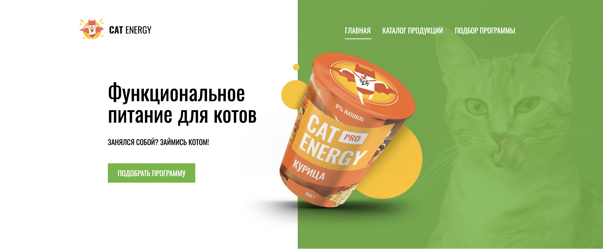

# Личный проект «Кэт энерджи»

* Студент: [Дудак Ксения](https://up.htmlacademy.ru/adaptive/31/user/917321).
* Наставник: [Антипина Ирина](https://htmlacademy.ru/profile/id2108789).

---

Репозиторий создан для обучения на профессиональном онлайн‑курсе «[HTML и CSS. Адаптивная вёрстка и автоматизация](https://htmlacademy.ru/intensive/adaptive)» от [HTML Academy](https://htmlacademy.ru).

[check-image]: https://github.com/htmlacademy-adaptive/917321-cat-energy-31/workflows/Project%20check/badge.svg?branch=master
[check-url]: https://github.com/htmlacademy-adaptive/917321-cat-energy-31/actions
